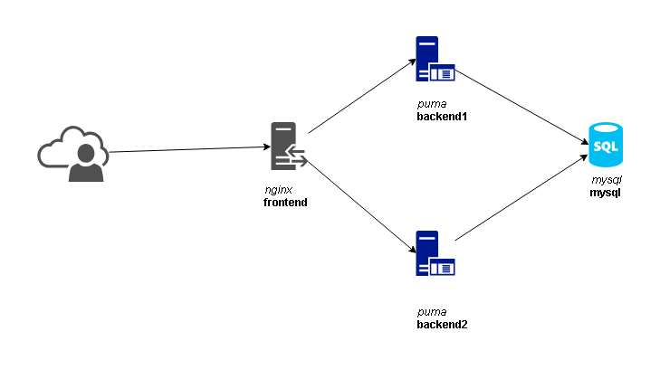

# The Simple App

## Table of Contents

1. [Overview](#overview)
1. [Getting Started](#getting-started)
1. [Running On Your Local Machine](#running-on-your-local-machine)
    * [Prerequisites](#prerequisites)
    * [Deployment](#deployment)
    * [Usage](#usage)
    * [Running tests (optional)](#running-tests-optional)
    * [Limitations](#limitations)

## Overview

This is an example app that outputs the list of employees that are Male which birth date is 1965-02-01 and the hire date is greater than 1990-01-01 ordered by the Full Name of the employee. The app is built on top of [Sinatra framework](http://sinatrarb.com) and uses https://github.com/datacharmer/test_db as an example data set.

## Getting Started

These instructions will get you a copy of the project up and running on your local machine. See deployment for notes on how to deploy the project on a live system.

## Running On Your Local Machine

Local deployment will get you four VirtualBox instances  running on top of Ubuntu 16.04 LTS:
- frontend

  [Nginx](https://www.nginx.com) as a proxy

- backend1 and backend2

  [Puma](http://puma.io/)'s managed by Systemd

- mysql

  [Example data set](https://github.com/datacharmer/test_db) running on top of MySQL



### Prerequisites

* Install Git

    Go to the [Git download page](https://git-scm.com/download), choose your operating system and download and install the software.

* Install VirtualBox

    Go to the [VirtualBox download page](https://www.virtualbox.org/wiki/Downloads), choose your operating system and download and install the software.

* Install Vagrant And Plugins

    Go to the [Vagrant download page](https://www.vagrantup.com/downloads.html), choose your operating system and download and install the software.

    Run command:
    ```
    # Install vagrant plugin
    vagrant plugin install vagrant-hosts

    ```
* Ensure TCP Port 8080 is not occupied on your host system.

### Deployment
In command-line under your project directory:
```
# Grab the Git repository
git clone https://github.com/tioteath/simple-app.git && cd simple-app

# Get the data example and install Puppet modules
git submodule update --init --recursive

# Deploy the project
vagrant up

```
### Usage
Follow http://localhost:8080 in your browser.


Use vagrant to operate the project environment:
```
# Stop
vagrant halt
# Start and provision
vagrant up --provision
# Restart
vagrant restart
# Apply Puppet manifests
vagrant up --provision --provision-with puppet
# Restart the backend's so the app code modifications are available
vagrant ssh -c 'sudo service app restart' backend1
vagrant ssh -c 'sudo service app restart' backend2

```

### Running tests (optional)

Install Serverspec Vagrant plugin to enable [Serverspec](https://serverspec.org) tests.
```
# Install serverspec plugin
vagrant plugin install vagrant-serverspec
# Run standalone tests
vagrant provision --provision-with serverspec
```

### Limitations
The version of software had been used:
```
git version 2.19.1
VirtualBox Version 5.2.20 r125813
Vagrant 2.2.0
vagrant-hosts 2.8.3
vagrant-serverspec 1.3
```
You may face different kind of issues in case the version of software you are using does not match.
